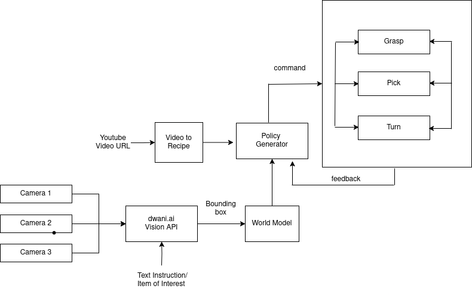

Biryani Bot

Workflow



- Video to Recipe : Hemanth K
- World Model : Sachin

- Running the Robot
  ```bash
  python -m venv venv
  source venv/bin/activate
  pip install -r requirements.txt
  ```

- Video to Recipe
  ```bash
  cd video_to_recipe/
  uvicorn main:app
  ```

- World Model
  ```bash
  cd world_model
  python all_world_v2.py
  ```

---

- Robot [actions](docs/action.md)
- Inference [Setup](docs/setup.md)
- Research [Papers](docs/papers.md)
- Reference [Links](docs/links.md)